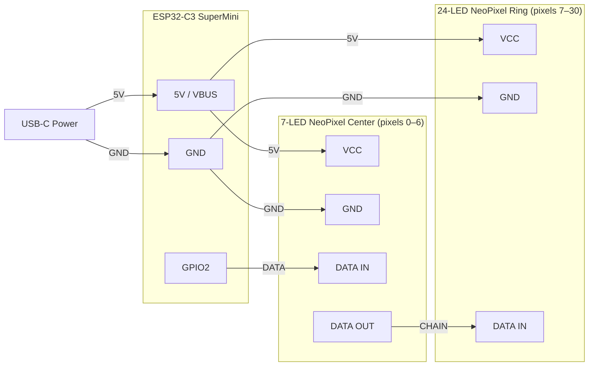

# CW3D Arc Reactor

**Iron Man–inspired NeoPixel arc reactor badge built on an ESP32-C3 SuperMini running CircuitPython.**

Created by [Crash Works 3D](https://crashworks3d.com) for a hands-on panel at [Compass Community Collaborative School](https://compassfortcollins.org/) — a project-based learning school in Fort Collins, CO serving grades 6–12.

Students snap together a pre-printed shell, seat the pre-wired NeoPixel rings, fasten three screws, and plug in USB-C. The reactor glows. Then they learn why.

---

## What's in This Repo

```
src/
  code.py             CircuitPython arc reactor animation (teaching edition)
  blink_test.py       Quick single-pixel sanity check

scripts/
  flash.sh            One-command firmware + filesystem flash tool

stl/
  crystal_ring.stl          Outer diffuser — seats 24-LED NeoPixel ring
  main_crystal_bottom.stl   Inner diffuser — seats 7-LED center component
  main_crystal_top.stl      Top diffuser cap
  main_crystal_enclosure.stl  Crystal shell enclosure
  upper_grid.stl            Decorative outer shell
  lower_grid_and_caps.stl   Back plate + end caps

docs/
  batch-flash-log.md                    Per-board flash & test checklist
```

---

## Hardware (Per Kit)

| Part | Qty | Notes |
|---|---|---|
| ESP32-C3 SuperMini (black PCB) | 1 | ~$3–4, AliExpress or Amazon |
| WS2812b 24-LED NeoPixel ring | 1 | Outer crystal — AliExpress or Adafruit |
| WS2812b 7-LED NeoPixel component | 1 | Center crystal — AliExpress |
| 22–24 AWG stranded wire | short lengths | Pre-soldered directly |
| M3×20mm screws | 3 | Holds shell together |

**Estimated cost per kit: ~$9–14** (3D print filament not included)

### Wiring

The two NeoPixel components are **daisy-chained** on a single data line. The 7-LED center is first in the chain:



| Signal | From | To |
|---|---|---|
| 5V (USB VBUS) | ESP32-C3 5V | 7-LED VCC + 24-LED VCC |
| GND | ESP32-C3 GND | 7-LED GND + 24-LED GND |
| DATA | ESP32-C3 GPIO2 | 7-LED center DATA IN |
| CHAIN | 7-LED center DATA OUT | 24-LED ring DATA IN |

Pixel indices: 0–6 = center cluster, 7–30 = outer ring (31 total).

> **Why GPIO2?** Avoids the GPIO8 conflict on some ESP32-C3 variants and is safe for RMT-based NeoPixel signaling.

---

## 3D Printing

All STL files are in the `stl/` folder. These are remixed from [aelkaim's arc reactor on Printables](https://www.printables.com/model/233261-iron-man-arc-reactor) to accommodate the full dual-ring electronics.

| Part | Material | Infill |
|---|---|---|
| Crystal ring, bottom, top, enclosure | Transparent PETG or PLA | 100% |
| Upper grid, lower grid + caps | Silk Silver PLA | Standard |

Print crystal/diffuser parts at **100% infill** — lower infill reduces light diffusion.
Target outer diameter: **~65mm** to seat the 24-LED ring.

---

## Firmware Setup

### Requirements

- [esptool.py](https://github.com/espressif/esptool) (`pip install esptool`)
- Python 3.11+

### Step 1 — Download the CircuitPython firmware

Download the `.bin` file for **Maker Go ESP32C3 Supermini** from:
[circuitpython.org/board/makergo_esp32c3_supermini/](https://circuitpython.org/board/makergo_esp32c3_supermini/)

Place it in the `bin/` folder at the project root with this exact filename:

```
bin/adafruit-circuitpython-makergo_esp32c3_supermini-en_US-10.1.4.bin
```

> The `bin/` folder is git-ignored. You must download the firmware manually — it is not included in this repo.

### Step 2 — Flash

```bash
bash scripts/flash.sh [/dev/cu.usbmodem14301]
```

The script will prompt you to put the board in download mode (BOOT + RESET), then:

1. Erases flash
2. Writes CircuitPython firmware
3. Builds a FAT12 filesystem image containing `code.py` and `lib/neopixel.mpy`
4. Writes the filesystem to the ESP32-C3 user partition

After flashing, unplug and reconnect to a USB-C power source — the animation starts immediately.

> **Note on the ESP32-C3 and USB:** The ESP32-C3 SuperMini uses an internal USB Serial/JTAG controller (no USB OTG). The CIRCUITPY drive does **not** appear on the host computer. Files are deployed by building a FAT12 image and flashing it directly. Use [Thonny](https://thonny.org/) for interactive REPL access.

### Manual Installation (Thonny)

1. Flash CircuitPython using the [Adafruit web installer](https://circuitpython.org/board/makergo_esp32c3_supermini/)
2. Open Thonny → connect to the ESP32-C3
3. Copy `src/code.py` → `/code.py` on device
4. Copy `neopixel.mpy` → `/lib/neopixel.mpy` on device
5. Press RESET — animation starts

---

## The Code

[`src/code.py`](src/code.py) is intentionally written as a **teaching document**. Every section has a comment explaining the concept in plain language for a middle-school audience.

### What It Teaches

| Concept | Code |
|---|---|
| Libraries | `import board`, `import neopixel`, `import math` |
| Variables / constants | `BRIGHTNESS`, `SLEEP_MS`, `SWEEP_RATE`, … |
| Objects | `neopixel.NeoPixel(...)`, `auto_write=False` |
| Sine wave / math | `(math.sin(t * OUTER_SPEED + i * PHASE_STEP) + 1) / 2` |
| Loops + modulo | `CENTER_COUNT + int(t * SWEEP_RATE) % OUTER_COUNT` |
| RGB color mixing | `(r, g, b)` tuples, values 0–255 |
| Two independent zones | `range(CENTER_COUNT)` vs `range(CENTER_COUNT, NUM_PIXELS)` |
| Frame buffering | `pixels.show()` called once per frame |
| Frame pacing | `time.sleep(SLEEP_MS / 1000)` |

---

## Credits

- **Original 3D model:** [aelkaim on Printables](https://www.printables.com/model/233261-iron-man-arc-reactor) / [Thingiverse mirror](https://www.thingiverse.com/thing:2799642)
- **CircuitPython:** [Adafruit](https://circuitpython.org/)
- **Designed and remixed by:** [Crash Works 3D](https://crashworks3d.com)

---

## License

Firmware, scripts, and documentation in this repository are licensed under the [Crash Works 3D Software License Agreement](LICENSE.md) — personal, non-commercial use only. See `LICENSE.md` for full terms.

3D models in `stl/` are derived from [aelkaim's arc reactor](https://www.printables.com/model/233261-iron-man-arc-reactor) and are subject to the original model's license terms.
