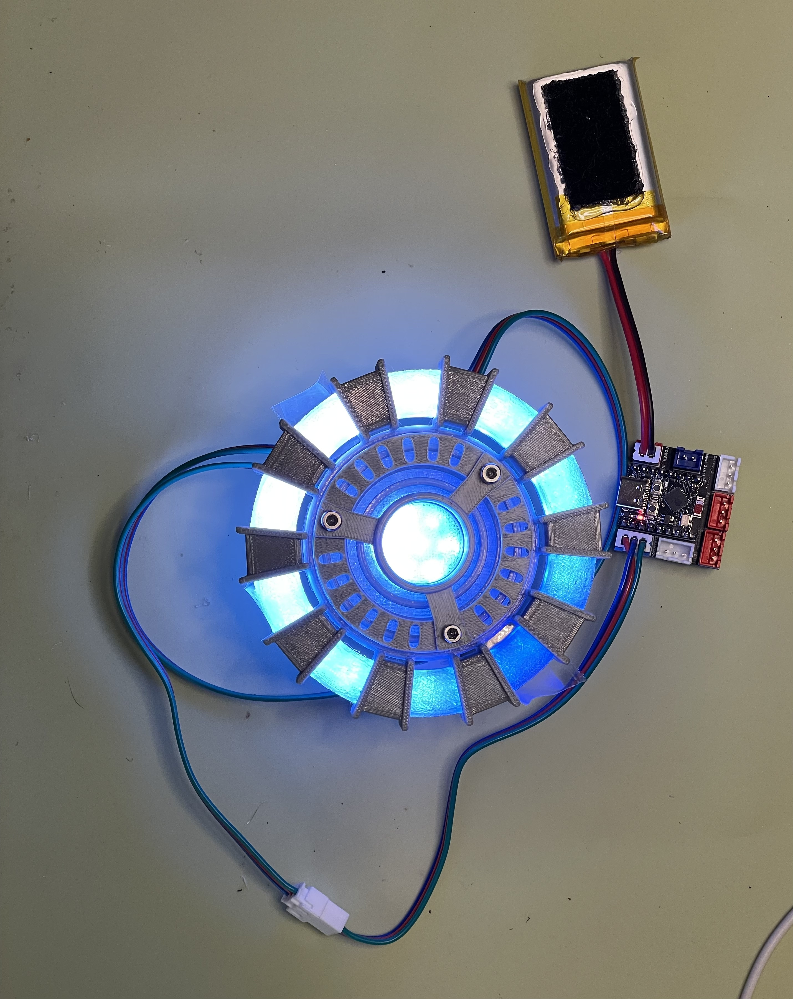
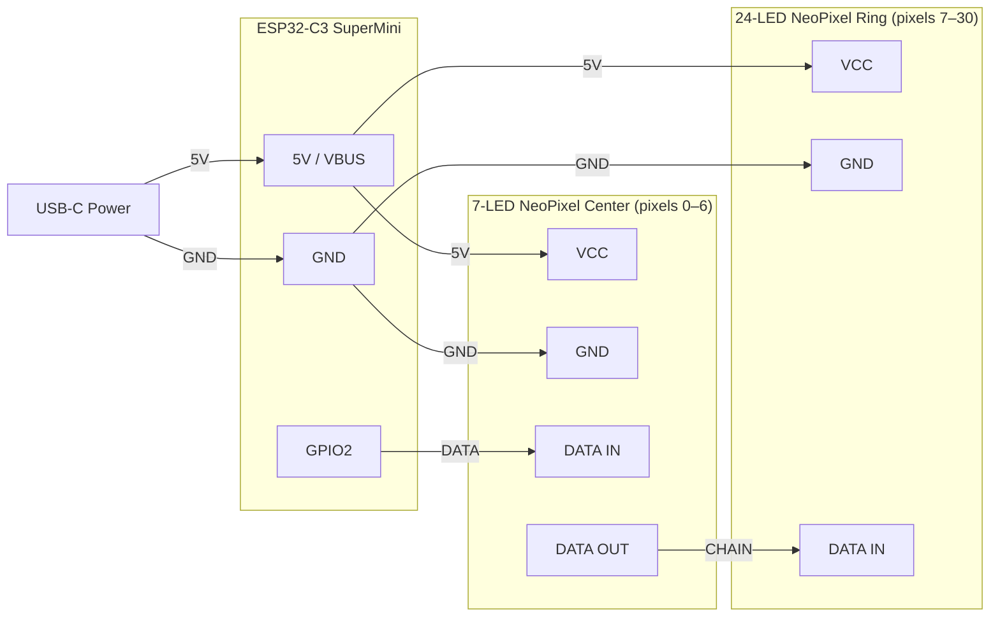

# CW3D Arc Reactor

**Iron Man–inspired NeoPixel arc reactor built on an ESP32-C3 SuperMini running CircuitPython.**

Created by [Crash Works 3D](https://crashworks3d.com) for a hands-on panel at [Compass Community Collaborative School](https://compassfortcollins.org/) — a project-based learning school in Fort Collins, CO serving grades 6–12.

Students assemble a pre-printed shell, seat the pre-wired NeoPixel rings, fasten three screws, and plug in USB-C. The reactor glows. Then they learn why.



---

## What's in This Repo

```
src/
  code.py             CircuitPython arc reactor animation (teaching edition)
  blink_test.py       Quick single-pixel sanity check

scripts/
  flash.sh            One-command flash tool (macOS/Linux — bash)
  flash.py            One-command flash tool (macOS/Linux/Windows — Python)

stl/
  crystal_ring.stl          Outer diffuser — seats 24-LED NeoPixel ring
  main_crystal_bottom.stl   Inner diffuser — seats 7-LED center component
  main_crystal_top.stl      Top diffuser cap
  main_crystal_enclosure.stl  Crystal shell enclosure
  upper_grid.stl            Decorative outer shell
  lower_grid_and_caps.stl   Back plate + end caps

docs/
  batch-flash-log.md                    Per-board flash & test checklist
```

---

## Hardware (Per Kit)

| Part | Qty | Notes |
|---|---|---|
| ESP32-C3 SuperMini (black PCB) | 1 | ~$3–4, AliExpress or Amazon |
| WS2812b 24-LED NeoPixel ring | 1 | Outer crystal — AliExpress or Adafruit |
| WS2812b 7-LED NeoPixel component | 1 | Center crystal — AliExpress |
| 22–24 AWG stranded wire | short lengths | Pre-soldered directly |
| M3×20mm screws | 3 | Main shell assembly |
| M3×12mm screws | 3 | Crystal enclosure (`main_crystal_enclosure.stl`) |
| M2×5mm self-tapping screws | 2 | Secures 7-LED jewel in `main_crystal_bottom.stl` |

> **Drill note:** Due to print scaling, screw holes may need to be bored out with a **7/64" drill bit** before M3 screws will fit cleanly.

**Estimated cost per kit: ~$9–14** (3D print filament not included)

### Wiring

The two NeoPixel components are **daisy-chained** on a single data line. The 7-LED center is first in the chain:



| Signal | From | To |
|---|---|---|
| 5V (USB VBUS) | ESP32-C3 5V | 7-LED VCC + 24-LED VCC |
| GND | ESP32-C3 GND | 7-LED GND + 24-LED GND |
| DATA | ESP32-C3 GPIO2 | 7-LED center DATA IN |
| CHAIN | 7-LED center DATA OUT | 24-LED ring DATA IN |

Pixel indices: 0–6 = center cluster, 7–30 = outer ring (31 total).

> **Why GPIO2?** Avoids the GPIO8 conflict on some ESP32-C3 variants and is safe for RMT-based NeoPixel signaling.

### Electronics Concepts

**Microcontroller — ESP32-C3 SuperMini**
A microcontroller is a tiny computer on a single chip. Unlike a laptop, it runs one program (`code.py`) on an endless loop. The ESP32-C3 has GPIO (General Purpose Input/Output) pins you control directly from code — GPIO2 is the pin that sends the LED data signal.

**Addressable LEDs — WS2812b**
Each LED in this project is a WS2812b: a standard RGB LED with a tiny controller chip built inside the package. The chip understands a single-wire serial protocol — the microcontroller sends a stream of bits, each LED reads exactly 24 bits (8 bits each for red, green, blue), then passes the rest of the stream down to the next LED. One wire from GPIO2 controls all 31 pixels.

**Power — VCC and GND**
Every circuit needs two power connections: VCC (positive, 5V here from USB-C) and GND (ground, 0V). All components share a single power rail and common ground. The `BRIGHTNESS = 0.35` cap in code keeps current draw safe for a standard USB port.

**The Daisy Chain**
The 7-LED center and 24-LED ring are wired in series on the data line. The first LED reads its 24-bit color instruction and forwards the rest of the stream to the next, all the way down the chain. Each full animation frame sends 31 × 24 = 744 bits.

### What This Circuit Teaches

| Concept | Component | Learning Moment |
|---|---|---|
| Microcontrollers | ESP32-C3 SuperMini | A single chip that runs your code — no OS, no distractions |
| GPIO pins | GPIO2 → LED DATA IN | Code talks to the physical world through numbered pins |
| Power rails | VCC (5V) + GND | Every circuit needs + and − power connections |
| Voltage | USB-C → 5V | Electricity has "pressure" — USB delivers a safe, standard 5V |
| Addressable LEDs | WS2812b | Each LED has its own controller chip — 24 bits sets RGB color |
| Serial data protocol | Single wire, 744 bits/frame | One wire with clever timing controls all 31 LEDs |
| Daisy chaining | DATA OUT → DATA IN | LEDs pass data down the line like a telephone game |
| Current limiting | `BRIGHTNESS = 0.35` | More pixels + brighter = more current; cap protects the USB port |

---

## 3D Printing

All STL files are in the `stl/` folder. These are remixed from [aelkaim's arc reactor on Printables](https://www.printables.com/model/233261-iron-man-arc-reactor) to accommodate the full dual-ring electronics.

| Part | Material | Infill |
|---|---|---|
| Crystal ring, bottom, top, enclosure | Transparent PETG or PLA | 100% |
| Upper grid, lower grid + caps | Silk Silver PLA | Standard |

Print crystal/diffuser parts at **100% infill** — lower infill reduces light diffusion.
Target outer diameter: **~65mm** to seat the 24-LED ring.

---

## Firmware Setup

### Requirements

- Python 3.8+
- [esptool](https://github.com/espressif/esptool) — `pip install esptool`

### Step 1 — Download the CircuitPython firmware

Download the `.bin` file for **Maker Go ESP32C3 Supermini** from:
[circuitpython.org/board/makergo_esp32c3_supermini/](https://circuitpython.org/board/makergo_esp32c3_supermini/)

Place it in the `bin/` folder at the project root with this exact filename:

```
bin/adafruit-circuitpython-makergo_esp32c3_supermini-en_US-10.1.4.bin
```

> The `bin/` folder is git-ignored. You must download the firmware manually — it is not included in this repo.

### Step 2 — Flash

Two flash scripts are provided. Both do the same thing — choose based on your OS:

**macOS / Linux** (bash):
```bash
bash scripts/flash.sh [port]
```

**macOS / Linux** (Python):
```bash
python3 scripts/flash.py [port]
```

**Windows** (Python):
```bash
python scripts/flash.py [port]
```

Default ports if none is specified:

| OS | Default port |
|---|---|
| macOS | `/dev/cu.usbmodem14301` |
| Linux | `/dev/ttyUSB0` |
| Windows | `COM3` |

The script will prompt you to put the board in download mode (BOOT + RESET), then:

1. Erases flash
2. Writes CircuitPython firmware
3. Builds a FAT12 filesystem image containing `code.py` and `lib/neopixel.mpy`
4. Writes the filesystem to the ESP32-C3 user partition

After flashing, unplug and reconnect to a USB-C power source — the animation starts immediately.

> **Note on the ESP32-C3 and USB:** The ESP32-C3 SuperMini uses an internal USB Serial/JTAG controller (no USB OTG). The CIRCUITPY drive does **not** appear on the host computer. Files are deployed by building a FAT12 image and flashing it directly. Use [Thonny](https://thonny.org/) for interactive REPL access.

### Manual Installation (Thonny)

1. Flash CircuitPython using the [Adafruit web installer](https://circuitpython.org/board/makergo_esp32c3_supermini/)
2. Open Thonny → connect to the ESP32-C3
3. Copy `src/code.py` → `/code.py` on device
4. Copy `neopixel.mpy` → `/lib/neopixel.mpy` on device
5. Press RESET — animation starts

---

## The Code

[`src/code.py`](src/code.py) is intentionally written as a **teaching document**. Every section has a comment explaining the concept in plain language for a middle-school audience.

### What It Teaches

| Concept | Code |
|---|---|
| Libraries | `import board`, `import neopixel`, `import math` |
| Variables / constants | `BRIGHTNESS`, `SLEEP_MS`, `SWEEP_RATE`, … |
| Objects | `neopixel.NeoPixel(...)`, `auto_write=False` |
| Functions | `def arc_reactor(pixels, t):` |
| Swappable behavior | `animate = arc_reactor` → `animate = rainbow_chase` |
| Sine wave / math | `(math.sin(t * OUTER_SPEED + i * PHASE_STEP) + 1) / 2` |
| Loops + modulo | `CENTER_COUNT + int(t * SWEEP_RATE) % OUTER_COUNT` |
| RGB color mixing | `(r, g, b)` tuples, values 0–255 |
| Color wheel helper | `colorwheel(pos)` — maps 0–255 to a rainbow color |
| Two independent zones | `range(CENTER_COUNT)` vs `range(CENTER_COUNT, NUM_PIXELS)` |
| Frame buffering | `pixels.show()` called once per frame |
| Frame pacing | `time.sleep(SLEEP_MS / 1000)` |

---

## Troubleshooting

### Hardware

**No LEDs light up after plugging in USB-C**
- Confirm the USB-C cable is a data+power cable (some cables are charge-only)
- Try a different USB-C port or charger — the board needs at least 500 mA
- Check that the ESP32-C3 power LED is on; if not, the board isn't receiving power
- Verify all three solder joints on the ESP32-C3 (5V, GND, GPIO2)

**Only the center LEDs light up (outer ring is dark)**
- The daisy-chain connection between the 7-LED center DATA OUT and the 24-LED ring DATA IN may be broken
- Inspect the solder joint or wire connection between the two components
- Confirm pixel index constants in `code.py` match your chain order (`CENTER_COUNT = 7`)

**Only a few pixels in the ring light up or the colors look wrong**
- A broken DATA wire causes all downstream LEDs to go dark or stick to the last received color
- Check the DATA OUT → DATA IN connection at each link in the chain
- Try reducing `BRIGHTNESS` to rule out a power issue on longer chains

**One pixel is always bright white or shows garbage color**
- That LED's internal controller chip may be damaged (common from static or overvoltage)
- Set that pixel to `(0, 0, 0)` in code as a workaround; the rest of the chain is unaffected

**Board gets warm and LEDs are dim or flicker**
- USB port may be current-limited (common on older laptop ports)
- Reduce `BRIGHTNESS` in `code.py` — try `0.2` as a starting point
- Use a USB-C phone charger instead of a computer port

**Screws won't thread into the printed holes**
- Print tolerances vary — bore out M3 holes with a **7/64" (2.8 mm) drill bit**
- For M2 holes in `main_crystal_bottom.stl`, use a **5/64" (2 mm) drill bit**

---

### Software / Flashing

**`python: command not found` on macOS or Linux**
- macOS ships `python3`, not `python` — use `python3 scripts/flash.py`
- Verify Python is installed: `python3 --version`

**`No module named esptool`**
- Install esptool: `pip install esptool` (or `pip3 install esptool`)
- Confirm the install succeeded: `esptool.py version` or `python3 -m esptool version`

**`A fatal error occurred: Failed to connect to ESP32-C3`**
- The board was not put into download mode before flashing
- Hold **BOOT**, tap **RESET**, release **BOOT** — then immediately re-run the script
- Try a slower baud rate by editing `BAUD = '115200'` in `flash.py`
- Try a different USB cable (data+power required)

**Wrong port error (e.g., `No such file or directory: /dev/cu.usbmodem14301`)**
- Find your port: macOS/Linux: `ls /dev/cu.*` or `ls /dev/tty.*`; Windows: Device Manager → Ports
- Pass the port explicitly: `python3 scripts/flash.py /dev/cu.usbmodem12345`

**Flash succeeds but the board shows no animation after reset**
- Verify `code.py` and `lib/neopixel.mpy` exist in the project (`src/` and `bundle/`)
- Check the paths printed by `flash.py` — it validates all three files before proceeding
- Re-run the full flash sequence to rewrite the filesystem image

**`ImportError: no module named 'neopixel'` in CircuitPython REPL**
- The `neopixel.mpy` file was not written to the filesystem correctly
- Re-run `flash.py` — Step 3 rebuilds and Step 4 rewrites the FAT12 image

**Thonny can't connect to the board**
- CircuitPython's USB Serial/JTAG may need a moment after reset — wait 2–3 seconds and retry
- In Thonny: Tools → Options → Interpreter → select **CircuitPython (generic)** and the correct port
- On Linux, add your user to the `dialout` group: `sudo usermod -a -G dialout $USER` (requires logout/login)

---

## Credits

- **Original 3D model:** [aelkaim on Printables](https://www.printables.com/model/233261-iron-man-arc-reactor) / [Thingiverse mirror](https://www.thingiverse.com/thing:2799642)
- **CircuitPython:** [Adafruit](https://circuitpython.org/)
- **Designed and remixed by:** [Crash Works 3D](https://crashworks3d.com)

---

## License

Firmware, scripts, and documentation in this repository are licensed under the [Crash Works 3D Software License Agreement](LICENSE.md) — personal, non-commercial use only. See `LICENSE.md` for full terms.

3D models in `stl/` are derived from [aelkaim's arc reactor](https://www.printables.com/model/233261-iron-man-arc-reactor) and are subject to the original model's license terms.
